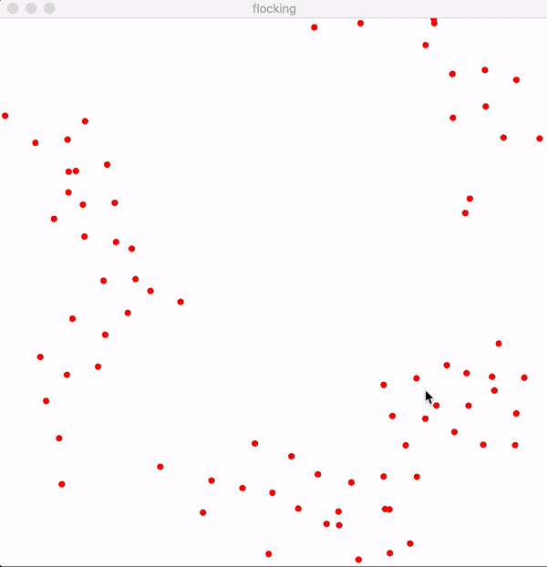

Wikipedia states that [flocking](https://en.wikipedia.org/wiki/Flocking_(behavior)) is a behavior exhibited when a group of birds, called a flock, are foraging or in flight.
Flocking simulation are basically softwares which simulate this flocking behavior of birds.
The original algorithm is developed by Craig Reynolds in 1986.

<!--more-->

Flocking has super cool real world applications.

- Computer animations. Flocking is used widely in screensavers and many films. **Batman Returns (1992)** is one of the most popular movies to apply this algorithm. Flocking is used to animate swarming bats in this movie.
- In aerospace engineering, flocking can be used to control unmanned air vehicles (UAV).

# Boids

Flocking was first simulated in 1986 by Craig Reynolds with his program called [Boids](https://en.wikipedia.org/wiki/Boids).
In this program, individual agents (boids) move around the view by adhering to 3 simple rules

- **Separation** - steer to avoids crowding local flockmates
- **Alignment** - steer towards average heading of local flockmates
- **Cohesion** - steer to move toward the average position (center of mass) of local flockmates


In rust, I will use a simple struct Boid to represent an individual agent.

```rust
struct Boid {
    // position
    x: f64,
    y: f64,

    // velocity
    vx: f64,
    vy: f64,
}
```

`vx`, and `vy` are used to represent the velocity for x and y axis.
I'm using `f64` here to make my life simpler when doing calculation.

The main flocking method looks like this.

```rust
// flock based on it's neighbors
// returns the x and y components of resultant vector
fn flock(&self, boids: &[Boid]) -> (f64, f64) {
    let alignment = self.align(&boids);
    let cohesion = self.cohere(&boids);
    let separation = self.separate(&boids);

    let mut vx = self.vx + 
        alignment.0 * ALIGNMENT_WEIGHT + 
        cohesion.0 * COHESION_WEIGHT + 
        separation.0 * SEPARATION_WEIGHT;

    let mut vy = self.vy + 
        alignment.1 * ALIGNMENT_WEIGHT + 
        cohesion.1 * COHESION_WEIGHT + 
        separation.1 * SEPARATION_WEIGHT;

    vx = self.limit_speed(vx);
    vy = self.limit_speed(vy);

    (vx, vy)
}
```

The `vx`, and `vy` from three rules are computed and added together to return the resultant vector.
We have to take care of limiting the speed of the boids as well, since they can go extremely fast which is not something we want.

# Separation

This rule is respecting personal space. Imagine you're on a commute train. 
If someone comes too close to you, you would want to move away from them until you're comfortably far away from others to give yourself enough personal space.
For introverts like me, the separation factor would be really huge but let's just agree that boids doesn't have personality to keep things simple.

```Rust
fn separate(&self, boids: &[Boid]) -> (f64, f64) {
    let mut x = 0.0;
    let mut y = 0.0;

    for b in boids.iter() {
        let distance = self.distance_to(b);
        if distance > 0.0 && distance < SEPARATION_RADIUS {
            x -= b.x - self.x;
            y -= b.y - self.y;
        }
    }

    (x, y)
}
```

`distance_to(&self, b: &Boid)` is a simple method using Pythagoras theorem to compute the distance between boids.

```Rust
fn distance_to(&self, b: &Boid) -> f64 {
    let x = self.x - b.x;
    let y = self.y - b.y;

    (x*x + y*y).sqrt()
}
```

# Alignment

This rule states that the boids steer towards average heading of a local flockmates.
This is what peer pressure looks like.
If you see a group of people running for their lives in a direction, chances are that you might join them to avoid the impending doom you aren't even sure of simply because of peer pressure.
In boids, they try to match the x y velocity of nearby agents.

```Rust
fn align(&self, boids: &[Boid]) -> (f64, f64) {
    let mut x = 0.0;
    let mut y = 0.0;
    let mut count = 0.0;

    for b in boids.iter() {
        let distance = self.distance_to(b);
        if distance > 0.0 && distance < ALIGNMENT_RADIUS {
            x += b.vx;
            y += b.vy;
            count += 1.0;
        }
    }

    if count > 0.0 {
        x /= count;
        y /= count;
    }

    (x, y)
}
```

# Cohesion

In this rule, the centre of mass is simply the average of nearby boids' positions.
Boids try to fly towards the centre of mass of their neighbor boids.

```Rust
fn cohere(&self, boids: &[Boid]) -> (f64, f64) {
    let mut x = 0.0;
    let mut y = 0.0;
    let mut count = 0.0;

    for b in boids.iter() {
        let distance = self.distance_to(b);
        if distance > 0.0 && distance < COHESION_RADIUS {
            x += b.x;
            y += b.y;
            count += 1.0;
        }
    }

    if count > 0.0 {
        x /= count;
        y /= count;

        x -= self.x;
        y -= self.y;
    }

    (x,y)
}
```

This is all it's needed to simulate flocking. 
I used Piston to render the flocks, it's quite simple to render them.
Since I only have limited window to display the boids, the boids are magically transported to the other side of the window when they went past the boundary.

```Rust
if x > self.width as f64 {
    x -= self.width as f64;
} else if x < 0.0 {
    x += self.width as f64;
}

if y > self.height as f64 {
    y -= self.height as f64;
} else if y < 0.0 {
    y += self.height as f64;
}
```

The rendering is retrofitted Piston's getting started guide from [here](https://github.com/PistonDevelopers/Piston-Tutorials/tree/master/getting-started) with a few modification, so I am gonna skip explaining that part.

# Final Result

This is what the final result looks like.
The source code can be found [here](https://github.com/ha-shine/flocking).

