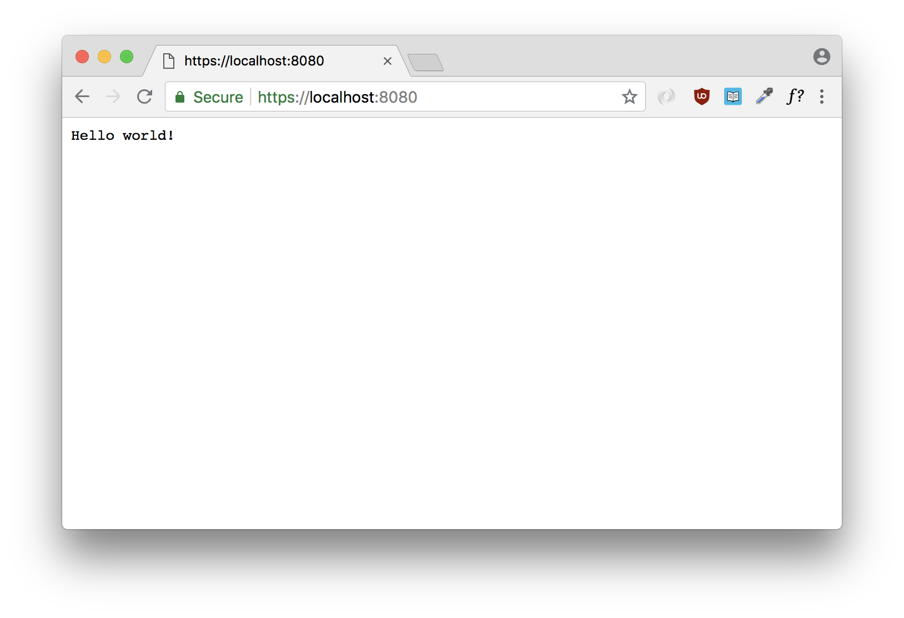

[mkcert](https://github.com/FiloSottile/mkcert) is a simple utility tool written in Go to make locally-trusted certificates with ease.
You can take a look at it's project page on how to install.
On mac, with homebrew it's pretty straight forward.

```bash
brew install --HEAD https://github.com/FiloSottile/mkcert/raw/master/HomebrewFormula/mkcert.rb
brew install nss # if you use Firefox
```

Afer installation, you can start making locally trusted certificates which can be used with Go's TLS server.
For our purpose, let's create a certificate with the name localhost.

```
mkcert -install
mkcert localhost
```

This will create two certificate files `localhost.pem` (certificate file) and `localhost-key.pem` (key file).

Using these two files with Go's TLS server is a straight forward task too.

```go
package main

import (
	"net/http"
	"fmt"
	"log"
)

func main() {
	http.HandleFunc("/", func(writer http.ResponseWriter, request *http.Request) {
		fmt.Fprintf(writer, "Hello world!")
	})

	log.Fatalln(http.ListenAndServeTLS(":8080", "/Users/shine/localhost.pem", "/Users/shine/localhost-key.pem", nil))
}
```

And that's it. Voila, Secured localhost!

