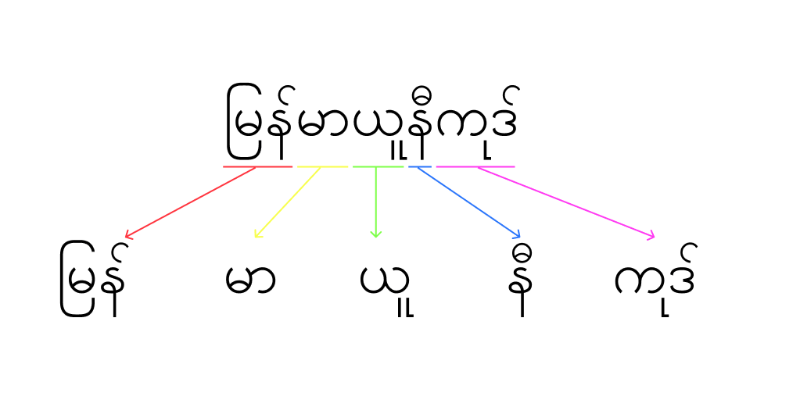
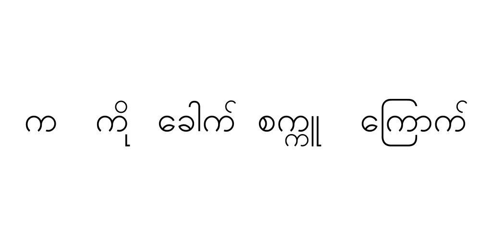

So **what exactly is a markov chain?**

In its simplest term, a markov process is a chain of events where the next state depends **ONLY** on current state. There is no relation between the future and the past state. For example, in a fibonacci sequence, you have to add current number and the number before the current number to get the next number. Hence, fibonacci sequence is not a markov chain because the future state depends on both present and past state. The best explanation on Markov Chain I have ever read is done by Victor Powell [here](http://setosa.io/ev/markov-chains/). Markov chains are used in a wide range of subjects. To give you a nearest example, Google's original trillion dollar [PageRank Algorithm](https://en.wikipedia.org/wiki/PageRank), used to rank webpages, is based on Markov Chain. In this post, I would mainly be talking about how Markov Chain can be used in text generation.

The fantastic news is generating text using markov chain is unbelievably straight forward. At the core of it's idea, a word is generated by looking at the prefix. I will try to explain how to do that, but if you want to dive right into code there's plethora of material available on how to do this. [Here](https://golang.org/doc/codewalk/markov/) is an implementation from golang codewalk. 

The markov chain is implemented by building a dictionary or a "chain" where the keys are the prefixes and the values are arrays of words which comes after those prefixes. Consider this text:

**I am not a number! I am a free man!**
{: style="text-align: center;" }

Let's assume we're using two words prefixes. After going through the text, you will get pairs of prefixes and suffixes like this.

|Prefix        |Suffix        |
|--------------|--------------|
|"I am"      |"not"           |
|"am not"      |"a"          |
|"not a"     |"number!"         |
|"a number!"   |"I"           |
|"number! I"    |"am"     |
|"I am"    |"a"     |
|"am a"    |"free"     |
|"a free"    |"man!"     |

The actual implemenation is a little bit different because we have to start with an empty string, but I excluded from this for clarification. These prefix and suffix paris are made into a dictionary. The resultant dictionary, well a part of, will look like this.

|Key           |Value         |
|--------------|--------------|
|"I am"      |["not", "a"]    |
|"not a"     |["number!"]     |
|"a number!"   |["I"]           |
|"number! I"    |["am"]     |
|"am a"    |["free"]     |
|"a free"    |["man!"]     |

After this, you generate the text by choosing a random word from the value based on the prefix. Let's say you start your text with "I am", to generate the next word, you look at this dictionary. You see two words "not" and "a" under the key ("I am"). You choose one of them randomly, so it can become either "I am not", or "I am a". An actual source text will be a lot longer than one sentence I am showing here and you will have plenty of choices. That's it for markov chain, pretty easy right?

Let's talk about **quirky features of Myanmar Langauge.**

In Myanmar language, we usually do not have spaces typed after every word, but only at sections and grammatically appropriate break points. Even then, choosing these break points may differ based on individual writing style. A group of words like below can be broken into individual words. So, word splitting functions included with most standard libraries won't work.

To make word splitting harder, there are small differences in how a new word can start or end. Like in the figure below, there are several ways the letter "က" can appear.

Not only that, we have a typeface that is widely used by the public that doesn't conform to the standards of unicode called "Zawgyi". But let's not talk about vulgarities here. I wrote small a Go utility library to do stuffs, including splitting burese words, detecting Zawgyi from unicode, etc. [here](https://github.com/ha-shine/mmutil). If you want to tackle this problem yourself, you can start by reading how [Myanmar Unicode renders](http://www.unicode.org/notes/tn11/UTN11_4.pdf).

If you want to play around with generating random paragraphs in myanmar language, you can go [here](https://ha-shine.github.io/mm_markov_generator/) and try generating texts yourself. The quality of the generated outcome mostly depends on the quality of the source corpus text as it with markov text generator. I will end my writing here as I have a few exams coming up and I just recently moved to a new company. I might add more content to this page, as I deem this post to be a bit short and lacking in content. But that's all for now. Hope I have taught you a thing or two.